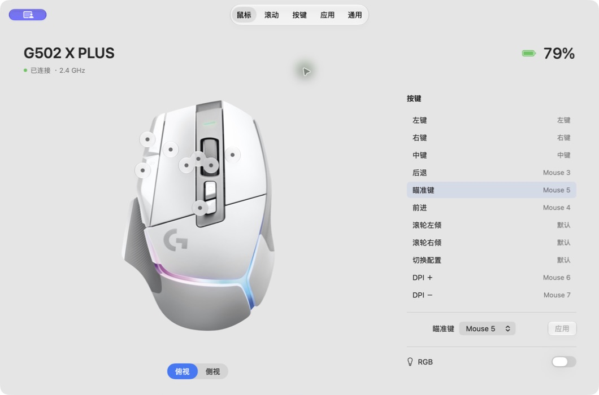

# Chuu

English | [简体中文](README.zh-CN.md)

A native macOS mouse companion for battery status, onboard buttons, smooth scrolling, and per-app settings. Built on [Mos](https://github.com/Caldis/Mos).

**Work in progress. No stable release or notarized installer yet.**



The screenshot is from a local development build. The Logitech product artwork is vendor-owned and is not included in the source. Builds without optional artwork use a generic mouse symbol.

## Features

- Native translucent window, menu-bar entry, and Liquid Glass app icon.
- Battery status in the app and a WidgetKit widget.
- Compact connection popup and optional low-battery notifications at 20%.
- G502 X PLUS onboard button mapping and RGB toggle, with backup and read-back verification.
- Smooth scrolling, global button shortcuts, and per-app settings inherited from Mos.
- Closing the window hides the Dock icon while Chuu continues running in the background.

The app polls battery status every 30 seconds while running and awake. Widget refresh timing is controlled by macOS. Third-party Qi charging modules may not report charging status. A connected receiver does not necessarily mean its mouse is awake; routine wireless timeouts do not trigger repeated connection popups.

## Supported Mice

| Model | Tested connection | Battery | Onboard buttons | RGB |
| --- | --- | --- | --- | --- |
| Logitech G502 X PLUS | 2.4 GHz, receiver `046D:C547` | Yes | Yes, validated onboard format only | On/off |
| MCHOSE G7 | 2.4 GHz, receiver `A8A5:2255` | Yes | Not implemented | Not implemented |
| Other standard HID mice | USB / Bluetooth | Requires an adapter | Not implemented | Not implemented |

**The author currently owns only a few mice, so hardware coverage is limited. Contributions for additional brands and models are welcome.** Sharing a brand, receiver family, or product name does not imply compatibility. Include your exact model, firmware, connection mode, interface IDs, sanitized response fixtures, and real-device results with an adapter contribution.

Start with the [mouse adapter guide](docs/mouse-adapters.md), [compiled test-only example](Examples/MouseAdapter/ExampleMouseAdapter.swift), and [contribution guide](CONTRIBUTING.md).

## Build

Requires macOS 14+ to run. Current development uses Xcode 27.1 and XcodeGen; older SDKs are not verified. Liquid Glass is used where the OS supports it.

1. Install Xcode and XcodeGen.
2. Configure your signing team and App Group using the [build guide](docs/build.md).
3. Generate and open `Chuu.xcodeproj`, select the **Chuu** scheme, and run.

```sh
xcodegen generate --spec project.yml
open Chuu.xcodeproj

./script/build_and_run.sh --build    # Build only
./script/build_and_run.sh --install  # Install to ~/Applications/Chuu.app
```

Scrolling and shortcuts require Accessibility permission. Avoid running multiple tools that intercept the same buttons. Quitting Chuu stops input processing and battery polling; closing its window does not.

## Project Layout

- `Chuu/`: application, input engine, device controls, and vendor adapters.
- `Chuu/Devices/<Vendor>/`: model-specific battery readers and hardware operations.
- `ChuuWidget/` and `Shared/`: widget, shared snapshots, and localization.
- `ChuuTests/` and `Examples/MouseAdapter/`: regression tests and a fixture-only adapter example.
- `project.yml`: source of truth for `Chuu.xcodeproj` and target membership.

See [architecture and compatibility](docs/architecture.md) for extension points and deliberately preserved identifiers. Configuration import/export, more device protocols, and gestures are future work.

## Credits and License

Chuu is a noncommercial fork of [Caldis/Mos](https://github.com/Caldis/Mos), retaining its history and [CC BY-NC 4.0 license](LICENSE). It is not an MIT-licensed project and is not affiliated with Mos or hardware vendors. See [NOTICES](NOTICES.md) for third-party material and [archived upstream documentation](docs/upstream/README.md).
